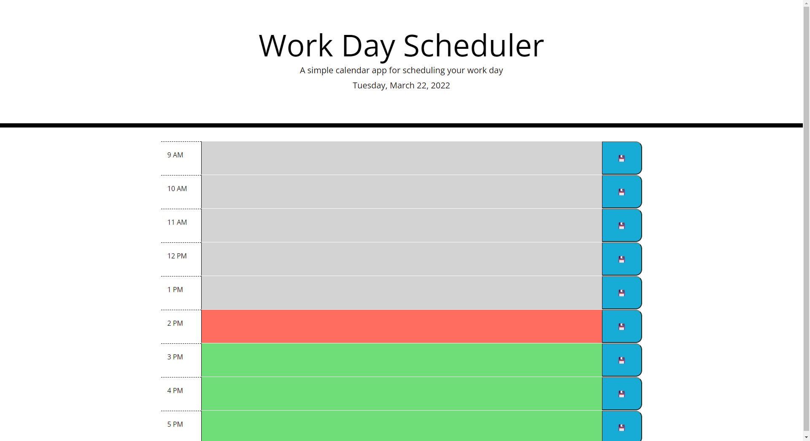

# Daily Scheduler

## Application

This application uses JavaScript to create a day worth of tasks that the user can save for when they leave and return. The current hour and corresponding task will display red, while past events display in grey, and future events display in green.

## APIs

This application makes use of jQuery and Boostrap. Even though JavaScript has adopted many of the functionalities of jQuery, it is still used in many web applications today, and this is why I used it in this application. I decided to use `Date()` for this, so it doesn't need to load an extra library which reduces the page's load time. However, there is an alternate script that uses Moment instead.

### Example

## Live Link

- - -
[Link to deployed page](https://phoenix-staley.github.io/Daily_Scheduler/)